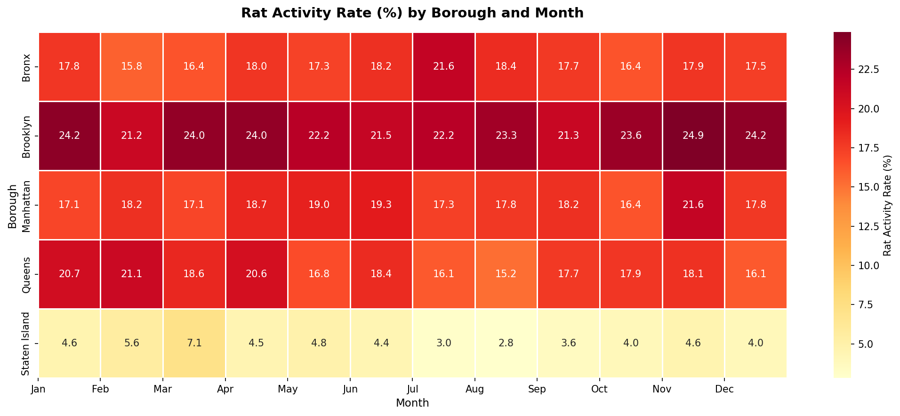
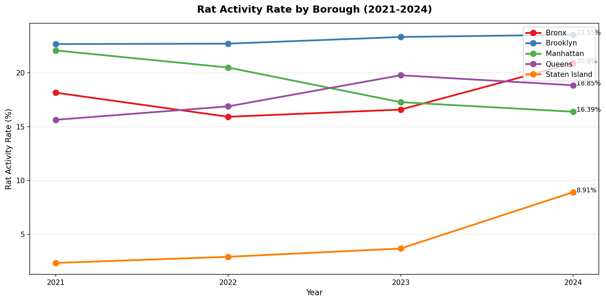
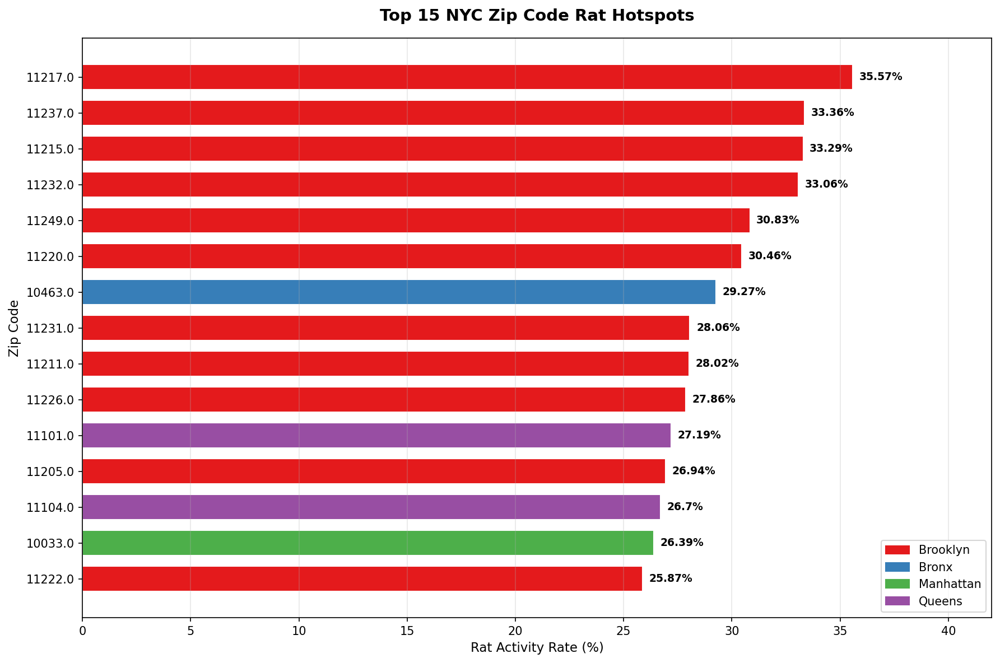

# NYC Rodent Inspection Analysis (2021–2024)

## Overview
End-to-end data analysis of 865,000+ NYC rodent inspection records 
sourced from NYC Open Data. This project explores rat activity patterns 
across all 5 boroughs, identifies high-risk zip code hotspots, analyzes 
inspection effectiveness, and surfaces year-over-year trends from 
2021 to 2024.

## Live Dashboard
🔗 [View Interactive Tableau Dashboard](https://public.tableau.com/app/profile/simon.yu3079/viz/NYCRodentInspectionAnalysis2021-2024/Dashboard1)

## Key Findings
- **Brooklyn** has the highest rat activity rate at 23% — nearly 
  1 in 4 inspections finds rats
- Citywide rat activity **improved from 2021 to 2023** but 
  reversed sharply in **2024 (+1.3%)**
- **Compliance inspections fail at 41.8%** vs 18.3% for initial 
  inspections — suggesting a systemic remediation gap
- **9 of the 10 worst zip codes** are in Brooklyn, led by 11217 
  at 35.6% activity rate
- **Manhattan is the only borough that improved** between 2021 
  and 2024, reducing its rate by 5.7 percentage points

## Visualizations

### Rat Activity Rate by Borough and Month


### Rat Activity Trends by Borough (2021-2024)


### Top 15 Zip Code Hotspots

```

## Tech Stack
- **Python** (Pandas, NumPy) — data cleaning and processing
- **SQLite / SQL** — analytical queries across 865K records
- **Tableau Public** — interactive dashboard
- **Jupyter Notebook** — end-to-end analysis environment

## Project Structure
```
nyc-rodent-inspection-analysis/
│
├── nyc_rodent_inspection.ipynb   # Full analysis notebook
├── borough_rat_rate.csv          # Rat activity rate by borough
├── yearly_trend.csv              # Year over year trend 2021-2024
├── zipcode_hotspots.csv          # Top 10 worst zip code hotspots
├── inspection_type_comparison.csv # Initial vs compliance results
├── borough_improvement.csv       # Borough improvement 2021 vs 2024
└── README.md
```

## Data Source
[NYC Open Data — Rodent Inspection Dataset](https://data.cityofnewyork.us/Health/Rodent-Inspection/p937-wjvj)

## Author
Simon Yu | [LinkedIn](https://www.linkedin.com/in/simon-yu-222b1b263/) | 
[Tableau Public](https://public.tableau.com/app/profile/simon.yu3079)
